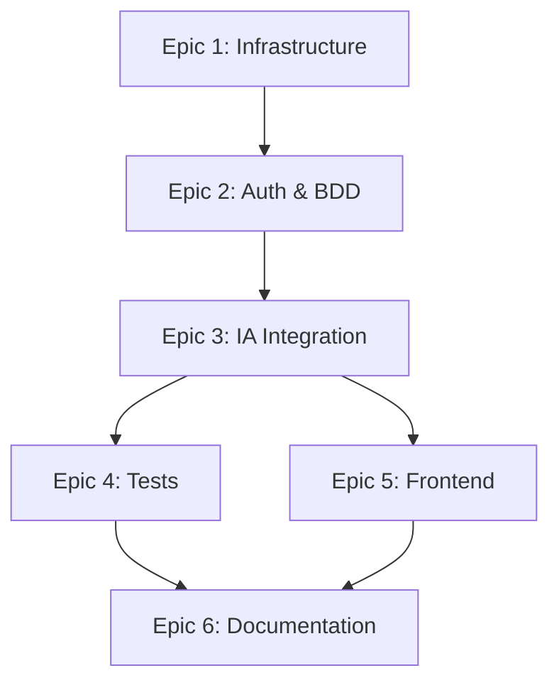

# Planification Projet Jira - Hybrid-Analyzer

Je vais structurer ce projet de manière logique et pragmatique pour Jira, en évitant la sur-découpe et en respectant l'ordre de réalisation.

## 🎯 Structure des Epics

### **Epic 1: Infrastructure & Configuration**
*Prérequis technique avant tout développement*

**User Stories:**
- **US-1.1**: Configuration de l'environnement de développement
  - Tâche: Setup PostgreSQL + variables d'environnement + Docker Compose
  
- **US-1.2**: Architecture et schémas techniques
  - Tâche: Créer les diagrammes d'architecture (workflow, BDD, API)

---

### **Epic 2: Backend Core - Authentification & Base de données**
*Fondation sécurisée du système*

**User Stories:**
- **US-2.1**: Modèle utilisateur et base de données
  - Tâche: Créer le schéma PostgreSQL (table users)
  - Tâche: Implémenter les modèles SQLAlchemy/ORM
  
- **US-2.2**: Système d'authentification JWT
  - Tâche: Endpoint POST /register avec hashage bcrypt
  - Tâche: Endpoint POST /login avec génération JWT
  - Tâche: Middleware de validation JWT

---

### **Epic 3: Intégration Services IA**
*Cœur métier - orchestration des APIs externes*

**User Stories:**
- **US-3.1**: Intégration Hugging Face Zero-Shot
  - Tâche: Client HTTP pour API Hugging Face + gestion erreurs
  - Tâche: Parser et valider les réponses (scores, catégories)
  
- **US-3.2**: Intégration API Gemini
  - Tâche: Client HTTP Gemini + prompt engineering contextualisé
  - Tâche: Parser résumé et détection de ton
  
- **US-3.3**: Orchestration complète
  - Tâche: Endpoint POST /analyze (protégé JWT)
  - Tâche: Chaînage HF → Gemini + agrégation JSON

---

### **Epic 4: Robustesse & Qualité**
*Fiabilisation du système*

**User Stories:**
- **US-4.1**: Gestion des erreurs et résilience
  - Tâche: Gestion timeouts, erreurs réseau, scores faibles
  - Tâche: Système de logging structuré (orchestration + performances)
  
- **US-4.2**: Tests automatisés
  - Tâche: Tests unitaires avec mocks (HF + Gemini)
  - Tâche: Tests d'intégration du workflow complet

---

### **Epic 5: Interface Frontend**
*Interface utilisateur*

**User Stories:**
- **US-5.1**: Pages d'authentification
  - Tâche: Formulaires Register/Login + gestion token JWT
  
- **US-5.2**: Interface d'analyse
  - Tâche: Formulaire saisie texte + appel API /analyze
  - Tâche: Affichage résultats (catégorie, score, résumé, ton) + états loading/erreur

---

### **Epic 6: Documentation & Déploiement**
*Finalisation projet*

**User Stories:**
- **US-6.1**: Documentation technique complète
  - Tâche: Rédiger README + documentation API + guide déploiement
  
- **US-6.2**: Conteneurisation et déploiement
  - Tâche: Dockerfile backend/frontend + Docker Compose final

---

## 📋 Ordre Logique d'Exécution
```
Epic 1 (Infrastructure) 
  ↓
Epic 2 (Auth + BDD) 
  ↓
Epic 3 (IA - HF puis Gemini puis orchestration)
  ↓
Epic 4 (Tests + Logs) - en parallèle avec Epic 5
  ↓
Epic 5 (Frontend)
  ↓
Epic 6 (Documentation + Déploiement)
```

---

## 🔗 Liaison GitHub - Conventions de Commit

### Structure des branches:
```
main
├── develop
    ├── feature/epic1-infrastructure
    ├── feature/epic2-authentication
    ├── feature/epic3-ia-integration
    ├── feature/epic4-tests-logging
    ├── feature/epic5-frontend
    └── feature/epic6-documentation
```

### Convention de commit (logique et atomique):
```
<type>(<scope>): <description>

[US-X.X] feat(auth): implement JWT authentication with bcrypt hashing
[US-X.X] feat(ia): integrate Hugging Face zero-shot classification
[US-X.X] fix(gemini): handle malformed API responses
[US-X.X] test(orchestration): add unit tests for HF-Gemini workflow
[US-X.X] docs(api): document /analyze endpoint with examples
```

**Types:**
- `feat`: nouvelle fonctionnalité
- `fix`: correction bug
- `test`: ajout/modification tests
- `refactor`: refactoring code
- `docs`: documentation
- `chore`: tâches maintenance (dépendances, config)

---

## ⚠️ Principes Anti-Sur-Découpage

**✅ BIEN:**
- "Créer le système d'authentification JWT complet" (register + login + middleware)
- "Intégrer client Hugging Face avec gestion erreurs"

**❌ MAL:**
- ~~"Importer la bibliothèque bcrypt"~~
- ~~"Écrire la fonction de validation email"~~
- ~~"Ajouter un try-catch dans la fonction X"~~

**Règle:** Si c'est codable en < 20 lignes ou fait partie intégrante d'une fonctionnalité atomique → ne pas créer de tâche séparée.

---

## 🔄 Exemple de Workflow Jira-GitHub

1. **Créer une tâche Jira:** `[US-2.2] Endpoint POST /register`
2. **Créer une branche:** `git checkout -b feature/US-2.2-register-endpoint`
3. **Commits logiques:**
```
   [US-2.2] feat(auth): setup user model and database schema
   [US-2.2] feat(auth): implement password hashing with bcrypt
   [US-2.2] feat(auth): create POST /register endpoint with validation
   [US-2.2] test(auth): add unit tests for registration flow
```
4. **Pull Request:** `[US-2.2] Implement user registration with secure password hashing`
5. **Lier PR à Jira:** Mentionner `US-2.2` dans la description
6. **Merger → automatiquement mettre à jour le statut Jira**

---

## 📊 Vue d'ensemble - Tableau récapitulatif

| Epic | User Stories | Durée estimée | Priorité |
|------|-------------|---------------|----------|
| Epic 1: Infrastructure | 2 US | 2-3 jours | P0 (Critique) |
| Epic 2: Auth & BDD | 2 US | 3-4 jours | P0 (Critique) |
| Epic 3: IA Integration | 3 US | 5-7 jours | P0 (Critique) |
| Epic 4: Tests & Qualité | 2 US | 3-4 jours | P1 (Haute) |
| Epic 5: Frontend | 2 US | 4-5 jours | P1 (Haute) |
| Epic 6: Documentation | 2 US | 2-3 jours | P2 (Moyenne) |

**Durée totale estimée:** 19-26 jours

---

## 🎯 Dépendances entre tâches


---

## 💡 Bonnes Pratiques Jira

### Statuts recommandés:
- **To Do**: Tâche planifiée
- **In Progress**: Développement en cours
- **Code Review**: PR créée, en attente de review
- **Testing**: Tests en cours
- **Done**: Mergé et validé

### Labels suggérés:
- `backend`
- `frontend`
- `ia-integration`
- `security`
- `documentation`
- `bug`
- `enhancement`

### Critères de complétion (Definition of Done):
- ✅ Code écrit et fonctionnel
- ✅ Tests unitaires passent
- ✅ Code reviewé et approuvé
- ✅ Documentation à jour
- ✅ Pas de régression détectée
- ✅ Mergé dans develop

---

Cette structure vous permet de planifier, coder et commiter de manière cohérente, sans tâches inutiles et avec une traçabilité claire entre Jira et GitHub.


# GitFlow pour Hybrid-Analyzer

## 🌳 Structure des Branches GitFlow
```
main (production)
│
├── develop (intégration)
│   │
│   ├── feature/US-1.1-environment-setup
│   ├── feature/US-1.2-architecture-diagrams
│   ├── feature/US-2.1-user-model-database
│   ├── feature/US-2.2-jwt-authentication
│   ├── feature/US-3.1-huggingface-integration
│   ├── feature/US-3.2-gemini-integration
│   ├── feature/US-3.3-orchestration-analyze
│   ├── feature/US-4.1-error-handling-logging
│   ├── feature/US-4.2-automated-tests
│   ├── feature/US-5.1-auth-pages
│   ├── feature/US-5.2-analysis-interface
│   ├── feature/US-6.1-technical-documentation
│   └── feature/US-6.2-docker-deployment
│
├── release/v1.0.0 (préparation release)
│
└── hotfix/critical-bug-name (corrections urgentes)
```

---

## 📋 Démarche GitFlow Complète

### **Phase 1: Initialisation du Projet**
```bash
# 1. Créer le repository et cloner
git clone https://github.com/votre-org/hybrid-analyzer.git
cd hybrid-analyzer

# 2. Initialiser GitFlow
git flow init

# Configuration recommandée:
# Branch name for production releases: main
# Branch name for "next release" development: develop
# Feature branches prefix: feature/
# Release branches prefix: release/
# Hotfix branches prefix: hotfix/
# Support branches prefix: support/
# Version tag prefix: v

# 3. Pousser develop
git push -u origin develop
```

---

## 🔄 Workflow par Epic

### **Epic 1: Infrastructure & Configuration**

#### **US-1.1: Configuration environnement**
```bash
# 1. Créer la feature depuis develop
git flow feature start US-1.1-environment-setup

# 2. Travailler sur la tâche
# Créer docker-compose.yml, .env.example, requirements.txt

# 3. Commits atomiques
git add docker-compose.yml .env.example
git commit -m "[US-1.1] chore(infra): setup PostgreSQL and Docker Compose configuration"

git add requirements.txt
git commit -m "[US-1.1] chore(infra): add Python dependencies for backend"

# 4. Pousser la feature (pour collaboration/backup)
git push origin feature/US-1.1-environment-setup

# 5. Terminer la feature (merge dans develop)
git flow feature finish US-1.1-environment-setup

# GitFlow va automatiquement:
# - Merger feature/US-1.1-environment-setup dans develop
# - Supprimer la branche feature locale
# - Revenir sur develop

# 6. Pousser develop
git push origin develop
```

#### **US-1.2: Architecture et schémas**
```bash
git flow feature start US-1.2-architecture-diagrams

# Travailler...
git commit -m "[US-1.2] docs(architecture): add system workflow diagram"
git commit -m "[US-1.2] docs(architecture): add database schema and API architecture"

git flow feature finish US-1.2-architecture-diagrams
git push origin develop
```

---

### **Epic 2: Backend Core - Auth & BDD**

#### **US-2.1: Modèle utilisateur**
```bash
git flow feature start US-2.1-user-model-database

# Travailler...
git commit -m "[US-2.1] feat(database): create users table schema with PostgreSQL"
git commit -m "[US-2.1] feat(models): implement User model with SQLAlchemy ORM"
git commit -m "[US-2.1] test(models): add unit tests for User model"

git flow feature finish US-2.1-user-model-database
git push origin develop
```

#### **US-2.2: Authentification JWT**
```bash
git flow feature start US-2.2-jwt-authentication

git commit -m "[US-2.2] feat(auth): implement POST /register endpoint with bcrypt"
git commit -m "[US-2.2] feat(auth): implement POST /login with JWT generation"
git commit -m "[US-2.2] feat(auth): add JWT validation middleware"
git commit -m "[US-2.2] test(auth): add integration tests for auth flow"

git flow feature finish US-2.2-jwt-authentication
git push origin develop
```

---

### **Epic 3: Intégration IA**

#### **US-3.1: Hugging Face**
```bash
git flow feature start US-3.1-huggingface-integration

git commit -m "[US-3.1] feat(ia): implement Hugging Face API client"
git commit -m "[US-3.1] feat(ia): add error handling for timeouts and network errors"
git commit -m "[US-3.1] feat(ia): parse and validate zero-shot classification response"
git commit -m "[US-3.1] test(ia): add unit tests with HF API mocks"

git flow feature finish US-3.1-huggingface-integration
git push origin develop
```

#### **US-3.2: Gemini**
```bash
git flow feature start US-3.2-gemini-integration

git commit -m "[US-3.2] feat(ia): implement Gemini API client with context prompt"
git commit -m "[US-3.2] feat(ia): add tone detection (positive/negative/neutral)"
git commit -m "[US-3.2] feat(ia): handle malformed Gemini responses"
git commit -m "[US-3.2] test(ia): add unit tests with Gemini API mocks"

git flow feature finish US-3.2-gemini-integration
git push origin develop
```

#### **US-3.3: Orchestration**
```bash
git flow feature start US-3.3-orchestration-analyze

git commit -m "[US-3.3] feat(api): create POST /analyze endpoint with JWT protection"
git commit -m "[US-3.3] feat(orchestration): implement HF to Gemini workflow"
git commit -m "[US-3.3] feat(orchestration): aggregate and format JSON response"
git commit -m "[US-3.3] test(orchestration): add end-to-end workflow tests"

git flow feature finish US-3.3-orchestration-analyze
git push origin develop
```

---

### **Epic 4: Tests & Qualité** (en parallèle avec Epic 5)
```bash
git flow feature start US-4.1-error-handling-logging

git commit -m "[US-4.1] feat(logging): implement structured logging system"
git commit -m "[US-4.1] feat(errors): add global exception handler with status codes"
git commit -m "[US-4.1] feat(resilience): add retry mechanism for external APIs"

git flow feature finish US-4.1-error-handling-logging
git push origin develop
```
```bash
git flow feature start US-4.2-automated-tests

git commit -m "[US-4.2] test(unit): complete unit test coverage for all modules"
git commit -m "[US-4.2] test(integration): add integration tests for complete workflow"
git commit -m "[US-4.2] chore(ci): setup GitHub Actions for automated testing"

git flow feature finish US-4.2-automated-tests
git push origin develop
```

---

### **Epic 5: Frontend**
```bash
git flow feature start US-5.1-auth-pages

git commit -m "[US-5.1] feat(frontend): create Register and Login forms"
git commit -m "[US-5.1] feat(frontend): implement JWT token management in localStorage"
git commit -m "[US-5.1] feat(frontend): add form validation and error display"

git flow feature finish US-5.1-auth-pages
git push origin develop
```
```bash
git flow feature start US-5.2-analysis-interface

git commit -m "[US-5.2] feat(frontend): create text input form for analysis"
git commit -m "[US-5.2] feat(frontend): implement API call to /analyze endpoint"
git commit -m "[US-5.2] feat(frontend): display results (category, score, summary, tone)"
git commit -m "[US-5.2] feat(frontend): add loading states and error handling"

git flow feature finish US-5.2-analysis-interface
git push origin develop
```

---

### **Epic 6: Documentation & Déploiement**
```bash
git flow feature start US-6.1-technical-documentation

git commit -m "[US-6.1] docs(readme): write comprehensive README with setup instructions"
git commit -m "[US-6.1] docs(api): document all API endpoints with examples"
git commit -m "[US-6.1] docs(architecture): finalize technical documentation"

git flow feature finish US-6.1-technical-documentation
git push origin develop
```
```bash
git flow feature start US-6.2-docker-deployment

git commit -m "[US-6.2] chore(docker): create Dockerfile for backend"
git commit -m "[US-6.2] chore(docker): create Dockerfile for frontend"
git commit -m "[US-6.2] chore(docker): finalize Docker Compose for production"

git flow feature finish US-6.2-docker-deployment
git push origin develop
```

---

## 🚀 Phase de Release

### **Préparer la Release v1.0.0**
```bash
# 1. Créer la branche release depuis develop
git flow release start v1.0.0

# 2. Derniers ajustements (version numbers, changelog, etc.)
git commit -m "chore(release): bump version to 1.0.0"
git commit -m "docs(changelog): add CHANGELOG for v1.0.0"

# 3. Tests finaux sur la branche release
# - Tests d'intégration complets
# - Tests de charge
# - Validation qualité

# 4. Terminer la release
git flow release finish v1.0.0

# GitFlow va automatiquement:
# - Merger release/v1.0.0 dans main
# - Créer un tag v1.0.0 sur main
# - Merger release/v1.0.0 dans develop
# - Supprimer la branche release

# 5. Pousser tout
git push origin main
git push origin develop
git push origin --tags
```

---

## 🔥 Hotfix (Correction Urgente en Production)

### **Scénario: Bug critique découvert en production**
```bash
# 1. Créer le hotfix depuis main
git flow hotfix start critical-jwt-expiration

# 2. Corriger le bug
git commit -m "[HOTFIX] fix(auth): correct JWT expiration time calculation"
git commit -m "[HOTFIX] test(auth): add regression test for JWT expiration"

# 3. Terminer le hotfix
git flow hotfix finish critical-jwt-expiration

# GitFlow va automatiquement:
# - Merger hotfix dans main
# - Créer un tag (ex: v1.0.1)
# - Merger hotfix dans develop
# - Supprimer la branche hotfix

# 4. Pousser
git push origin main
git push origin develop
git push origin --tags

# 5. Déployer immédiatement en production
```

---

## 📊 Tableau de Correspondance Jira-GitHub

| Jira | GitFlow Branch | Commit Prefix |
|------|----------------|---------------|
| Epic 1 | feature/US-1.x-* | [US-1.x] chore/docs |
| Epic 2 | feature/US-2.x-* | [US-2.x] feat/test |
| Epic 3 | feature/US-3.x-* | [US-3.x] feat/test |
| Epic 4 | feature/US-4.x-* | [US-4.x] feat/test |
| Epic 5 | feature/US-5.x-* | [US-5.x] feat |
| Epic 6 | feature/US-6.x-* | [US-6.x] docs/chore |
| Bug Prod | hotfix/* | [HOTFIX] fix |
| Release | release/v* | chore(release) |

---

## 🔗 Intégration Jira + GitHub

### **Configuration Webhooks**

1. **Lier les commits à Jira:**
   - Mentionner le ticket dans chaque commit: `[US-2.2] feat(auth): ...`
   - Jira détectera automatiquement les commits

2. **Automatiser les statuts:**
   - Création de branche → Jira: "In Progress"
   - Pull Request ouverte → Jira: "Code Review"
   - Merge dans develop → Jira: "Done"

3. **Pull Request Template:**
```markdown
## Description
[US-2.2] Implémentation du système d'authentification JWT complet

## Type de changement
- [x] Nouvelle fonctionnalité (feature)
- [ ] Correction de bug (fix)
- [ ] Documentation

## Checklist
- [x] Code testé localement
- [x] Tests unitaires ajoutés/mis à jour
- [x] Documentation mise à jour
- [x] Pas de régression détectée

## Lien Jira
https://votre-jira.atlassian.net/browse/US-2.2
```

---

## 🎯 Commandes GitFlow Essentielles

### **Features**
```bash
git flow feature start <nom>      # Créer depuis develop
git flow feature publish <nom>    # Pousser pour collaboration
git flow feature finish <nom>     # Merger dans develop
```

### **Releases**
```bash
git flow release start <version>  # Créer depuis develop
git flow release finish <version> # Merger dans main + develop + tag
```

### **Hotfixes**
```bash
git flow hotfix start <nom>       # Créer depuis main
git flow hotfix finish <nom>      # Merger dans main + develop + tag
```

### **Utilitaires**
```bash
git flow feature list             # Lister les features
git flow release list             # Lister les releases
git tag -l                        # Lister les tags
```

---

## ⚠️ Règles d'Or GitFlow

1. **JAMAIS de commit direct sur `main`**
   - `main` = production, uniquement via release/hotfix

2. **JAMAIS de commit direct sur `develop`**
   - `develop` = intégration, uniquement via feature finish

3. **Une feature = Une User Story**
   - Granularité cohérente avec Jira

4. **Commits atomiques et logiques**
   - Chaque commit = une modification cohérente et compilable

5. **Tests avant de finish**
   - Toujours tester avant `git flow feature finish`

6. **Synchro régulière**
   - Pull develop régulièrement pour éviter les conflits

---

## 📈 Timeline Exemple du Projet
```
Semaine 1: Epic 1 + Epic 2
├── feature/US-1.1 → develop
├── feature/US-1.2 → develop
├── feature/US-2.1 → develop
└── feature/US-2.2 → develop

Semaine 2-3: Epic 3
├── feature/US-3.1 → develop
├── feature/US-3.2 → develop
└── feature/US-3.3 → develop

Semaine 3-4: Epic 4 + Epic 5 (parallèle)
├── feature/US-4.1 → develop
├── feature/US-4.2 → develop
├── feature/US-5.1 → develop
└── feature/US-5.2 → develop

Semaine 4: Epic 6
├── feature/US-6.1 → develop
└── feature/US-6.2 → develop

Fin Semaine 4: Release
└── release/v1.0.0 → main (tag v1.0.0) + develop

Production:
└── hotfix si nécessaire
```

---

## 🛠️ Configuration Git Recommandée
```bash
# Aliases utiles
git config --global alias.lg "log --graph --oneline --decorate --all"
git config --global alias.st "status -sb"

# Configuration GitFlow
git config gitflow.branch.master main
git config gitflow.branch.develop develop
git config gitflow.prefix.feature feature/
git config gitflow.prefix.release release/
git config gitflow.prefix.hotfix hotfix/
git config gitflow.prefix.versiontag v
```

---

Cette démarche GitFlow vous assure un versioning propre, une traçabilité complète et une collaboration efficace entre Jira et GitHub.